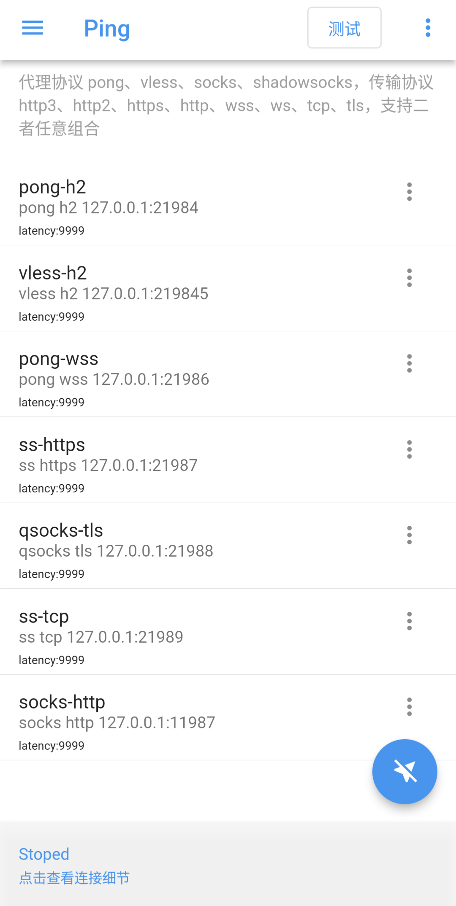
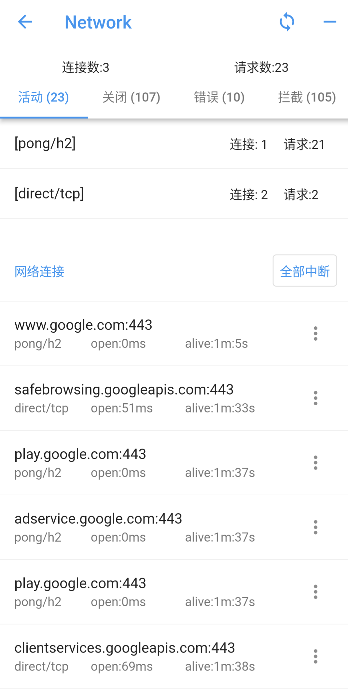
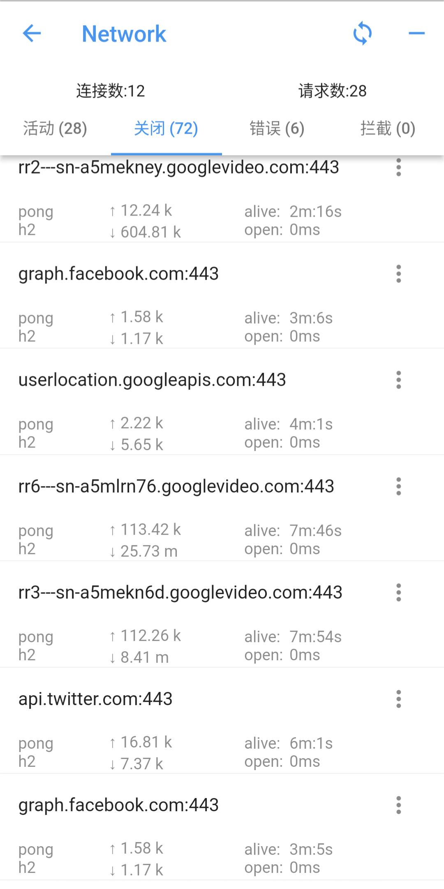
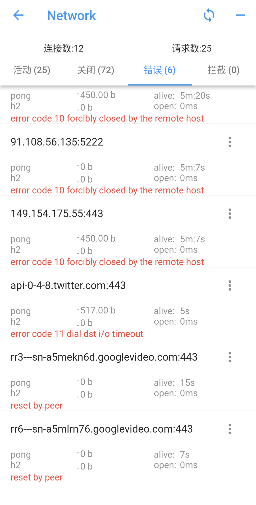
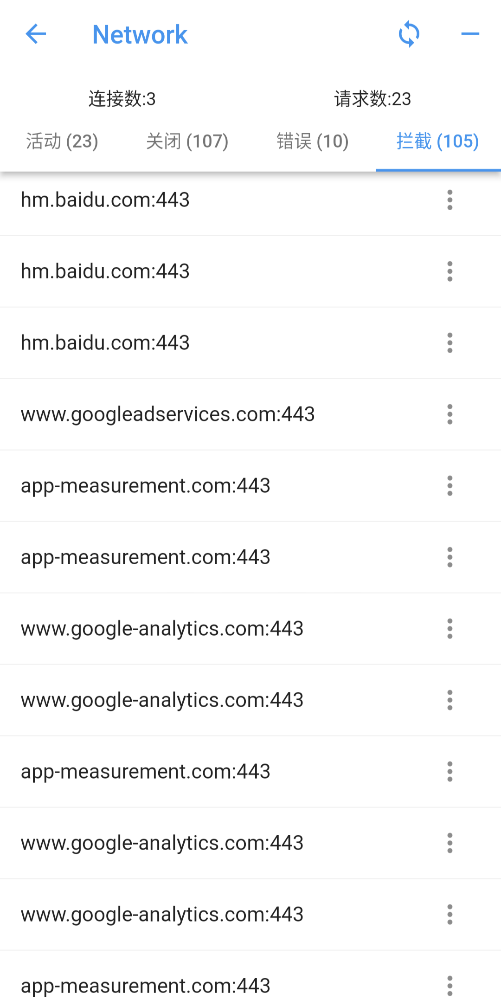
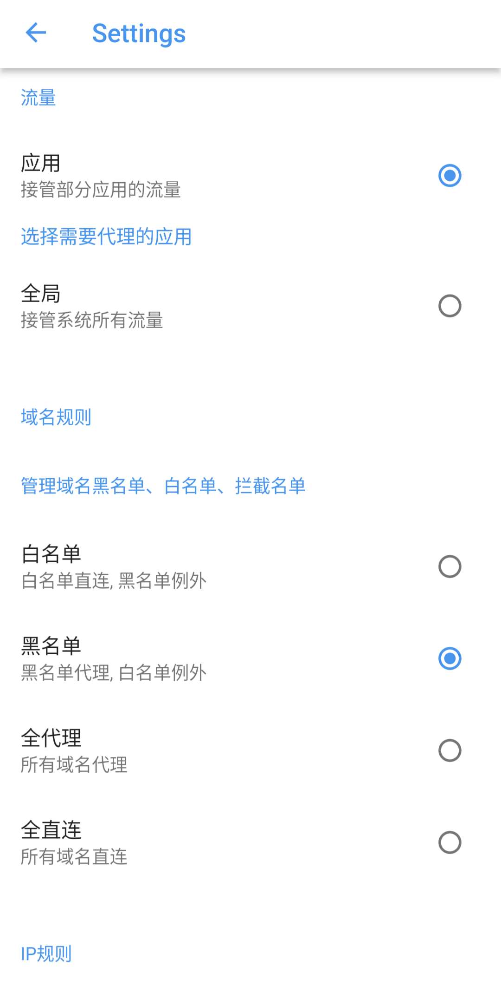
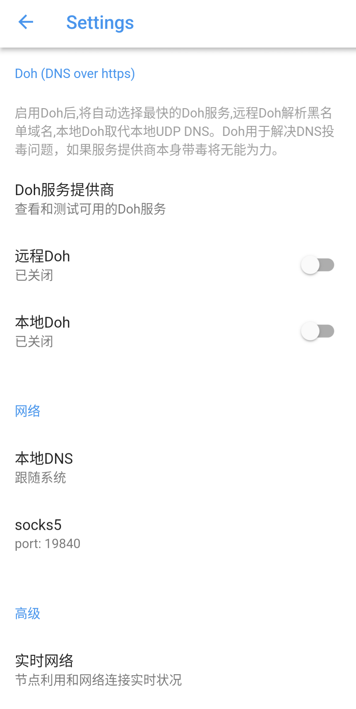
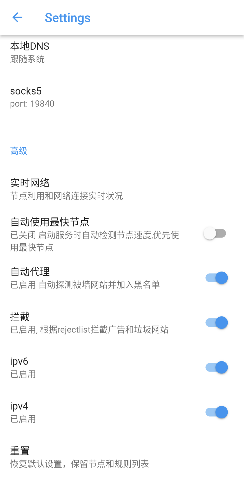

# ping

- [中文](README.md)
- [English](readme_en.md)

ping 是支持pong代理协议的android  网络代理客户端，
同时兼容vless,socks5,shadowsocks,qsocks 代理协议.

ping 使用 [pong-go](https://github.com/pingworlds/pong) 作为网络核心库。

注意：ping 是一个代理工具，本身不提供任何节点。

## 当前版本 v0.9.0

下载链接：

 <https://github.com/pingworlds/ping/releases/tag/v1.0.0>

##  屏幕截图

#### 代理节点
- 

#### 网络连接
- 

 

#### 设置

## transport protocols

支持以下传输协议：

- http2
- h2c
- http3
- ws
- wss
- https
- http
- tcp
- tls

## proxy protocols

pong 支持以下代理协议：
- pong
  
  建议首选

- shadowsokcs 

    仅支持明文

- vless

    仅支持明文

- socks5
    
    不支持验证

- qsocks 

没有握手过程的精简版socks5 

注意：所有代理协议，仅支持明文

## 设置

 
尽量保持默认设置,相对稳定 
 
  
### 设置选项建议 
 
- 流量接管模式 
  
    建议按app代理, 全局模式仍不稳定.

- Doh 服务 

    谨慎开启, doh服务对网络环境很敏感

          
- auto-try 
 
    建议开启, auto-try 表示直连不通的情况下自动代理,理论上可以不需要黑名单 

-拦截模式 

    建议开启, 广告鲜有漏网

          
- rule set 
 
    域名和IP规则分别以黑名单、白名单、拦截名单管理
 
- pass mode 
 
    建议域名黑名单模式. ip白名单模式
 
 

  

      

